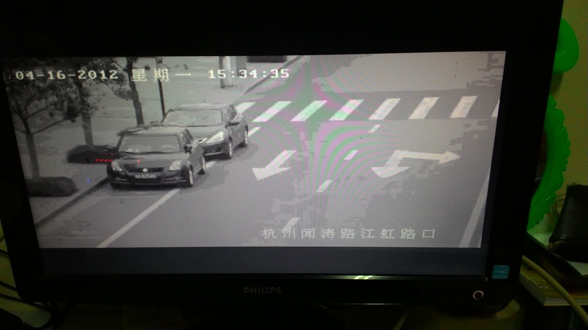
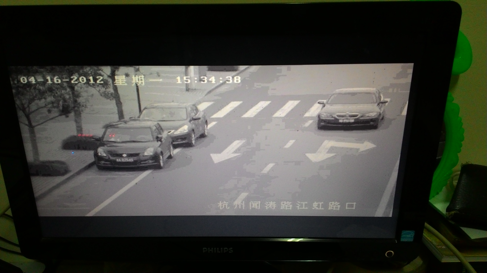
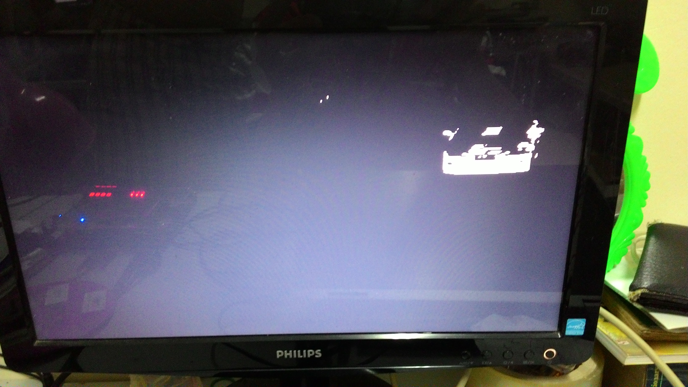
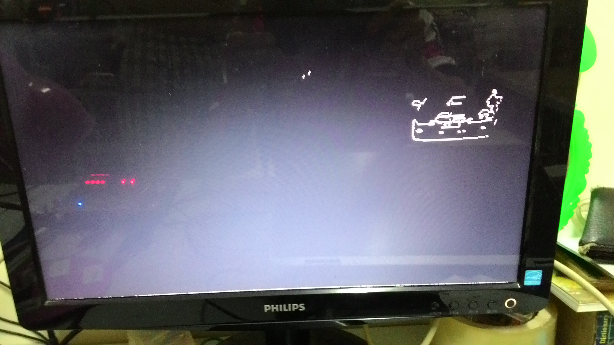

This project demonstrates how to use Altera DE1 Development and Education board to implement an object tracking algorithm.
The result will be displayed through the VGA interface.

The input images:

After the subtraction step, it results.

Applying the object detection algorithm, the final result is shown as follows.

